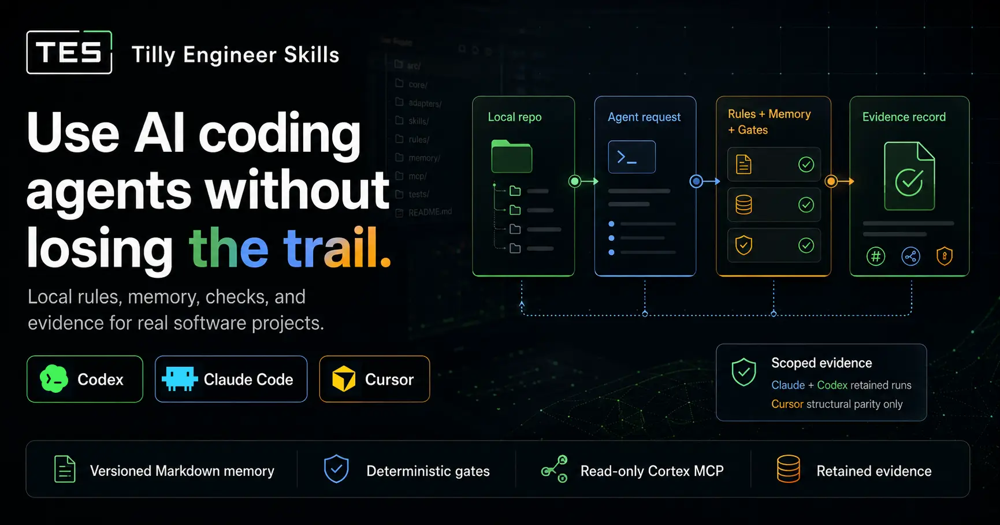

# Tilly Engineer Skills (TES)

[](package.json)
[](LICENSE)
[](https://github.com/murillodutt/tilly-engineer-skills/actions/workflows/field-report-governance.yml)
[](docs/mesh/CONTEXT-MESH-METHOD.md)
[](package.json)
[](https://murillodutt.github.io/tilly-engineer-skills/)

<p align="center">
  
</p>

**Live landing:** [murillodutt.github.io/tilly-engineer-skills](https://murillodutt.github.io/tilly-engineer-skills/)

**AI coding agents should leave local evidence your team can inspect.**

Tilly Engineer Skills (TES) is a local trust layer for working with AI inside
software projects. It surrounds coding agents with rules, local memory, checks,
safety limits, and operational evidence so teams can use AI with more control,
traceability, and confidence.

When an agent works inside a real repository, the hard part is not only getting
code. It is knowing which instructions governed the work, which project context
was loaded, which gate checked the outcome, which safety boundary held, and how
the next agent window can recover the trail.

TES answers that with a project-scoped context mesh: thin runtime surfaces for
Codex, Claude Code, and Cursor; versioned Markdown under `docs/agents/**`; local
oracles; Cortex memory and recall; and retained certification reports. Obsidian
is an optional view over the Markdown. TES does not require Obsidian, install
Obsidian plugins, or write `.obsidian/**`.

## What TES Can Safely Promise

| What TES is | Safe promise | Not a claim |
|-------------|--------------|-------------|
| A local trust layer for AI work inside software projects. | Helps teams use coding agents with more control, traceability, and confidence. | Does not make all AI agents safe, autonomous, or equivalent. |
| Adapter-aware runtime surfaces for Codex, Claude Code, and Cursor. | Routes each tool through a shared engineering contract in its native shape. | Does not claim universal cross-adapter behavior parity. |
| Filesystem-first Markdown memory with Cortex recall. | Keeps project context, decisions, evidence, and continuity inspectable in Git. | SQLite and MCP are derived access paths, not the source of truth. |
| Local gates, smoke tests, oracles, and retained reports. | Turns agent work into evidence that can be reviewed before closure. | Does not guarantee future model behavior, ROI, or statistical stability. |
| A public v0.3.82 installer bundle and assisted install path. | Gives adopters a concrete, local, rollback-aware way to install TES. | Does not push, publish, tag, amend commits, change remotes, or perform marketplace actions. |

Retained v1 evidence shows up to **6x baseline disciplined behavior in scoped
Claude CLI evals**, scoped Codex lift, and zero confirmed distractor leaks in the
retained certification scope. Cursor is included as structural/contract parity
only; Cursor behavior certification is not claimed.
[Evidence](docs/evidence/reports/context-mesh/context-mesh-v1-final-certification-2026-05-05/REPORT.md)

## 1. Start Safely

Open your target project in Codex, Claude Code, or Cursor and paste this into
the agent window:

```text
Install Tilly Engineer Skills as an assisted context mesh, not as blind file
copying.

Read and follow this raw installer spec:

https://raw.githubusercontent.com/murillodutt/tilly-engineer-skills/main/docs/install/ASSISTED-CONTEXT-INSTALLER.prompt.md

Run in quiet installer mode: show compact progress, blockers and the final
certification report only. Start by detecting the current IDE/runtime and
classifying this project as new, existing, or meshed. Stage the deterministic
TES bundle under .tes/setup/<version>/ from the public ZIP when available,
verify its SHA-256 before apply, create a central .tes/bk/<timestamp>/ backup,
apply the clean TES runtime, recover durable local governance semantics into
docs/agents/**, keep active AGENTS.md, CLAUDE.md, CURSOR.md and Cursor rules as
thin TES bootloaders, install TES-owned runtime capabilities such as /tes-align
and /tes-open-obsidian,
create the docs/agents/cortex/** continuity layer when needed, activate the
read-only project-scoped Cortex MCP server for the selected runtime route, and
finish with the certification report required by the spec.

Before installation edits, run Step Zero from the spec: inspect Git status and
offer a local baseline commit if the working tree is dirty. At the end, tell
me how to undo the installation with Git. Do not push, amend, tag, publish,
install dependencies, overwrite files outside the selected TES clean-runtime
route, overwrite root runtime files before .tes/bk/<timestamp>/manifest.json
exists, or change remotes unless I explicitly ask after reviewing the
certification report.
```

Short intents also work after the route is available:

```text
/tes-init
/tes-update
/tes-open-obsidian
/tes:init
/tes:update
Atualizar TES.
```

`/tes-init`, `/tes-update`, and `/tes-open-obsidian` are the preferred
cross-platform triggers. `/tes:init`, `/tes:update`, and
`/tes:open-obsidian` remain compatible intent aliases.

Canonical mini prompt: [docs/install/MINI-PROMPT.md](docs/install/MINI-PROMPT.md)

## Why Teams Use TES

| Without TES | With TES |
|-------------|----------|
| Each agent has separate prompt files and habits. | One context mesh routes Codex, Claude Code, Cursor, and optional Obsidian viewing. |
| Installation can overwrite local agent rules. | Step Zero and root-context gates preserve project governance. |
| Completion depends on model confidence. | Local oracles produce certification evidence. |
| Context disappears after the chat window. | Durable docs, evidence, Cortex, and wikilinks preserve continuity. |
| Teams cannot tell what changed agent behavior. | Benchmarks, parity gates, and Field Reports create feedback loops. |

TES is for teams that use AI coding agents inside real repositories and need
the agents to behave like careful collaborators, not disposable chat windows.

## What It Orchestrates

```text
docs/agents/**          project context mesh
AGENTS.md               Codex route
CLAUDE.md               Claude Code route
CURSOR.md               Cursor route
.tes/bin/**             local helper runtime
docs/agents/cortex/**   continuity and compiled knowledge
docs/agents/evidence/** certification records
Obsidian                optional visual workbench over Markdown
```

Runtime files stay thin. Project truth lives in versioned Markdown so people
can inspect it, review it, open it in Obsidian, and roll it back.

## Product Layers

| Layer | Role |
|-------|------|
| Governance | Four engineering gates: assumptions, simplicity, surgical scope, verification. |
| Adapter runtime | Thin Codex, Claude Code, and Cursor surfaces that route to one contract. |
| Assisted installer | Detects runtime, classifies project state, creates central backup, applies clean runtime, recovers governance semantics, and reports rollback. |
| Obsidian-ready mesh | Markdown properties, wikilinks, state, roadmap, decisions, quality gates, and evidence under `docs/agents/**`. |
| Local oracles | Validation, smoke, platform, materialization, MCP, Cortex, and Field Reports checks. |
| Evidence loop | Certification reports, evals, parity gates, and sanitized operational feedback. |
| Cortex | The continuity layer: auditable Markdown memory, recall, curation, and read-only MCP access. |

## 2. Trust And Audit

TES does **not** push, publish, tag, amend commits, change remotes, install
marketplace assets, send code telemetry, write `.obsidian/**`, or discard
project-owned governance. Clean install backs it up under `.tes/bk/**`, applies
the canonical runtime, and recovers supported semantics into `docs/agents/**`.

Cortex MCP is read-only and project-scoped. Field Reports, where used, carry
sanitized operational facts; never code, diffs, prompts, file contents, secrets,
or personal data. Live publication, release actions, marketplace actions, and
remote mutation require explicit authorization outside the default TES path.

The public v0.3.82 bundle is served from
[`docs/dist/0.3.82/`](docs/dist/0.3.82/) with SHA-256
`8598c167e9a70c744c7397c6880ce497da0b5416108dd797c191be0cbf9ec360`.

For this reference package, the full local closure gate is:

```bash
npm run commit:check
```

Focused maintainer gates:

```bash
npm run validate
npm run install:smoke
npm run cortex:self-test
npm run cortex:quality:self-test
npm run cortex:mcp:self-test
npm run field-reports:self-test
npm run field-reports:quality:self-test
npm run platform:surface:check
```

## Documentation

| Need | Link |
|------|------|
| Installation mini prompt | [docs/install/MINI-PROMPT.md](docs/install/MINI-PROMPT.md) |
| Live GitHub Pages landing | [murillodutt.github.io/tilly-engineer-skills](https://murillodutt.github.io/tilly-engineer-skills/) |
| Public installer bundle | [docs/dist/0.3.82/tilly-engineer-skills-0.3.82.zip](docs/dist/0.3.82/tilly-engineer-skills-0.3.82.zip) |
| GitHub Pages landing source | [docs/index.html](docs/index.html) |
| Current roadmap | [docs/roadmap/README.md](docs/roadmap/README.md) |
| RC1 readiness roadmap | [docs/roadmap/RC1-READINESS-ROADMAP.md](docs/roadmap/RC1-READINESS-ROADMAP.md) |
| User manual | [docs/install/USER-MANUAL.html](docs/install/USER-MANUAL.html) |
| Agent manual | [docs/install/AGENT-MANUAL.md](docs/install/AGENT-MANUAL.md) |
| Command routing | [docs/install/COMMAND-TRIGGERS.md](docs/install/COMMAND-TRIGGERS.md) |
| Context mesh method | [docs/mesh/CONTEXT-MESH-METHOD.md](docs/mesh/CONTEXT-MESH-METHOD.md) |
| Cortex continuity | [docs/mesh/CORTEX.md](docs/mesh/CORTEX.md) |
| Read-only MCP | [docs/mesh/CORTEX-MCP.md](docs/mesh/CORTEX-MCP.md) |
| Field Reports | [docs/mesh/FIELD-REPORTS.md](docs/mesh/FIELD-REPORTS.md) |
| Adapter support | [docs/adapters/ADAPTER-CAPABILITY-MATRIX.md](docs/adapters/ADAPTER-CAPABILITY-MATRIX.md) |

## License

MIT. See [LICENSE](LICENSE).
